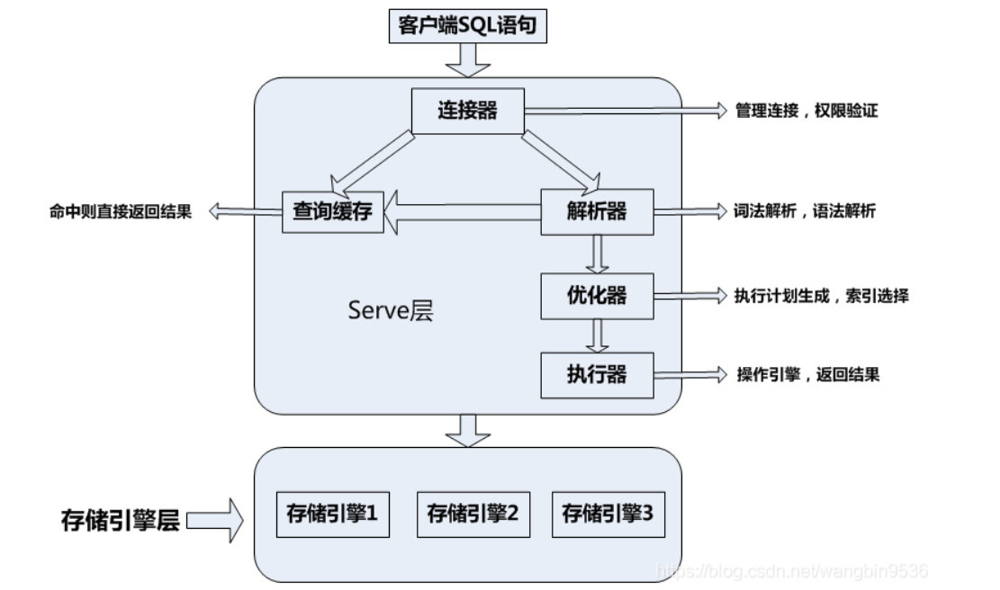

### 写sql  
- 查询班级男女生人数   
SELECT user.sex, count(user.sex) as 总数 FROM test.user group by user.sex;
- 查询top 10
SELECT top 10 * FROM EMP ORDER BY sal DESC；

### 1.基本的操作语句
创建数据库
CREATE DATABASE 数据库名;

删除数据库
drop database <数据库名>;

创建数据表：
CREATE TABLE table_name (column_name column_type);

删除数据表：
DROP TABLE table_name ;

插入一条数据
INSERT INTO table_name ( field1, field2,...fieldN ) VALUES  ( value1, value2,...valueN );

查询数据
Select 列 from 表名  where..

更新数据
Update table_name set  field1=new-value1, field2=new-value2 where ...

删除一条数据
Delete from table_name where 条件
### 2.连表查询
连接查询包括合并、内连接、外连接和交叉连接
- Union
UNION 操作符用于合并两个或多个 SELECT 语句的结果集。
UNION 内部的每个 SELECT 语句必须拥有相同数量的列。列也必须拥有相似的数据类型。同时，每个 SELECT 语句中的列的顺序必须相同。
```
SELECT ID,Name FROM Students
UNION
SELECT ID,Name FROM Teachers
```
- join从多个数据表中读取数据,Join按照功能大致分为如下三类：
- Inner join（内连接或等值连接）：获取两个表中字段匹配关系的记录
- LEFT JOIN（左连接）：获取左表所有记录，即使右表没有对应匹配的记录。
- RIGHT JOIN（右连接）： 与 LEFT JOIN 相反，用于获取右表所有记录，即使左表没有对应匹配的记录。
### 3. Mysql删除语句（delete/drop/truncate区别）
（1）Delete
用来删除表中的字段
Delete from tb where id = 1;如果delete中没有加入where就会把表中的记录都删掉
（2）Drop
用来删除数据库和表
删除数据库：drop database db;
删除表：drop table tb;
（3）Truncate
用来删除表中的所有字段
truncate table tb;
谁的速度更快以及原因
速度：一般来说：drop > truncate > delete
- Drop操作会直接删除表，将表所占用的空间全部释放掉，直接删除表结构，依赖的约束、索引以及触发器等，
- Truncate只会删除表中的数据，并不会删除表结构
- Delete只会删除表中的数据，并不会删除表结构
### 4.索引相关 
索引是帮助MYSQL高效获取数据的数据结构，简单来说，数据库索引好比一本书前面的目录，能加快数据库的查询速度
优点：可以提高数据库检索的效率，降低数据库的IO成本，
类型：
主键索引
普通索引
唯一索引
全文索引
空间索引
前缀索引

**（一）主键和唯一索引的区别**
本质：主键是一种约束，唯一索引是一种索引
主键创建后一定包含一个唯一性索引，唯一性索引并不一定是主键
主键列不允许空值，唯一索引列允许空值
主键可以被其他表引用为外键，而唯一索引不能
一个表最多只能创建一个主键，但可以创建多个索引
主键更适合那些不容易更改的唯一标识，比如自动递增列，身份证号，

**（二）数据库索引作用，原理，然后说为啥不能每个列都建索引**
第一，通过创建唯一性索引，可以保证数据库表中每一行数据的唯一性。
第二，可以大大加快数据的检索速度，这也是创建索引的最主要的原因。
第三，可以加速表和表之间的连接，特别是在实现数据的参考完整性方面特别有意义。
第四，在使用分组和排序 子句进行数据检索时，同样可以显著减少查询中分组和排序的时间。
第五，通过使用索引，可以在查询的过程中，使用优化隐藏器，提高系统的性能。

**不能每个列都建索引** ，这是因为：增加索引也有许多不利的一个方面。
第一，创建索引和维护索引要耗费时间，这种时间随着数据 量的增加而增加。
第二，索引需要占物理空间，除了数据表占数据空间之外，每一个索引还要占一定的物理空间，如果要建立聚簇索引，那么需要的空间就会更大。
第三，当对表中的数据进行增加、删除和修改的时候，索引也要动态的维护，这样就降低了数据的维护速度。

**（三）聚集索引和非聚集索引**
聚集索引（主键索引）和非聚集索引（二级索引）的区别
1. 聚集索引：指索引项的排序方式和表中数据记录排序方式一致的索引 
也就是说聚集索引的顺序就是数据的物理存储顺序。它会根据聚集索引键的顺序来存储表中的数据，即对表的数据按索引键的顺序进行排序，然后重新存储到磁盘上。因为数据在物理存放时只能有一种排列方式，所以一个表只能有一个聚集索引。
2. 非聚集索引： 索引顺序与物理存储顺序不同
非聚集索引是一种与存储在表中的数据相分离的索引结构，可对一个或多个选定列重新排序
如果查询语句是 select * from table where ID = 100，即主键查询的方式，则只需要搜索 ID 这棵 B+树。
如果查询语句是 select * from table where k = 1，即非主键的查询方式，则先搜索k索引树，得到ID=100，再到ID索引树搜索一次，这个过程也被称为回表。

### 5.数据库查询是如何执行的
 

### 6.数据库事务
数据库管理系统执行过程中的一个逻辑单位，由一个有限的数据库操作序列构成
特点：ACID
- **原子性**：事务要么全部完成，要么全部取消。 如果事务崩溃，状态回到事务之前
- **一致性**：如果2个事务 T1 和 T2 同时运行，事务 T1 和 T2 最终的结果是相同的，不管 T1和T2谁先结束。
- **隔离性**： 如果2个事务 T1 和 T2 同时运行，事务 T1 和 T2 最终的结果是相同的，不管 T1和T2谁先结束。

    -  事务隔离分为不同级别，包括
    -  读未提交（Read uncommitted）、
    -  读提交（read committed）、
    -  可重复读（repeatable read）
    -  串行化（Serializable）。

- **持久性：** 事务处理结束后，对数据的修改就是永久的，即便系统故障也不会丢失。

**数据库隔离级别**
1. **读未提交（Read uncommitted）：**
这种事务隔离级别下，select语句不加锁。此时，可能读取到不一致的数据，即“读脏 ”。这是并发最高，一致性最差的隔离级别。
2. **读已提交（Read committed）：**
可避免脏读的发生。在互联网大数据量，高并发量的场景下，几乎不会使用上述两种隔离级别。
3. **可重复读（Repeatable read）：**
MySql默认隔离级别。可避免 脏读 、不可重复读 的发生。
4. **串行化（Serializable ）：**
可避免 脏读、不可重复读、幻读 的发生。

### 7.sql关键词
- primary key  eg:primary key（student_id）
- not null
- foreign key references  eg:foreign key(course_id) references Course
