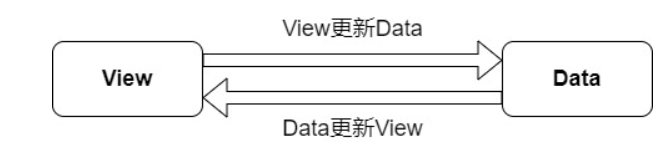
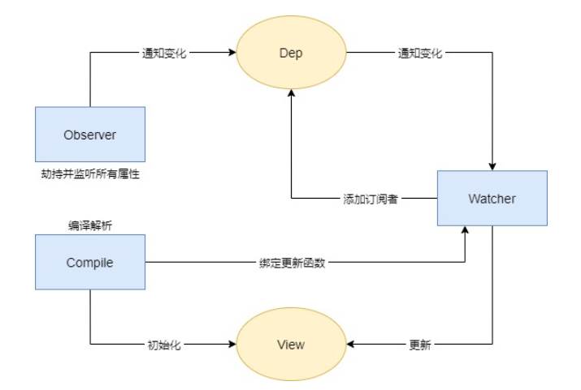

# vue的理解
- mvvm开发模式
- 组件化
    - 降低系统的耦合度
    - 调试方便
    - 便于维护
- 指令系统
# MVVM框架
### 一、定义

- M(model)：代表数据模型，数据和业务逻辑都在Model层中定义
- V(view):代表UI视图,即用户看到的界面，负责将数据模型中的数据的展示
- VM(view model):连接vm，每当V和M进行数据的调度时，都需要经过VM过中间的处理，使得 V层和 M层的同步工作完全是自动的。
### 二、双向绑定
#### 1.双向绑定(MVVM)原理
原理：数据变化更新视图，视图变化更新数据

Vue采用数据劫持+发布者-订阅者模式，通过Object.defineProperty()来劫持各个属性的setter、getter，在数据变动时发布消息给订阅者，触发相应的监听回调（Object.defineProperty可以控制一个对象属性的一些特有操作，比如读写权、是否可以枚举等，双向绑定时主要用到set和get属性）
#### 2.双向绑定(MVVM)原理

- 实现一个监听器Obsrver，用来劫持并监听所有属性，如果属性发生变化，就通知订阅者
- 实现一个订阅器Dep，用来收集订阅者，对监听器Observer和订阅者Watcher进行统一管理
- 实现一个订阅者Watcher，可以收到属性的变化通知并执行相应的方法，从而更新视图
- 实现一个解析器Compile，可以解析每个节点的相关指令，对模板数据和订阅器进行初始化