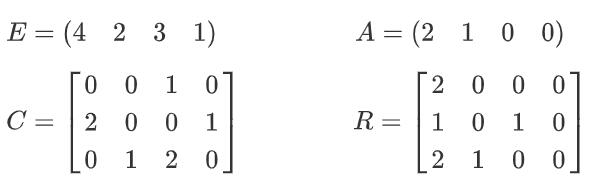
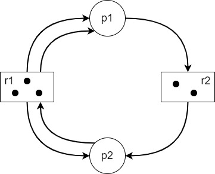
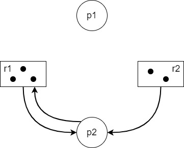
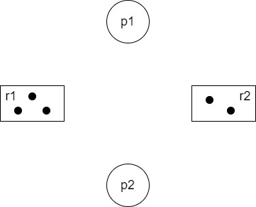

# 操作系统

前端的面试操作系统部分主要是一些基础的概念性知识或是易混淆的点，Linux、文件系统什么的比较难的部分一般考不到。

本章主要介绍以下六个高频知识点：

- [并发与并行](#并发与并行)
- [进程的三种状态](#进程的三种状态)
- [进程调度](#进程的三种状态)
- [进程间通信方式](#进程的三种状态)
- [进程与线程](#进程的三种状态)
- [死锁](#进程的三种状态)

## <a id="并发与并行">并发与并行</a>

并发：逻辑上的同时发生，强调有处理多个任务的能力但不一定要同时  
并行：物理上的同时发生，强调有同时处理多个任务的能力

打个比方，并发相当于一个人吃三个馒头，而并行相当于三个人吃三个馒头。而Erlang之父Joe Armstrong则用咖啡机和等待取咖啡的人来类比：并发是两条队列交替使用一台咖啡机，并行是两个队列同时使用两台咖啡机。

与可以一起出发的**并发**(concurrent)相对的是不可以一起出发的**顺序**(sequential)

- 顺序：上一个开始执行的任务完成后，当前任务才能开始执行
- 并发：无论上一个开始执行的任务是否完成，当前任务都可以开始执行

与可以一起执行的**并行**(parallel)相对的是不可以一起执行的**串行**(serial)

- 串行：有一个任务执行单元，从物理上就只能一个任务一个任务执行
- 并行：有多个任务执行单元，从物理上就可以多个任务一起执行

## <a id="进程的三种状态">进程的三种状态</a>
- 就绪（Ready）状态

  进程已分配到除CPU以外的所有必要资源，只要获得处理机便可立即执行。

- 执行（Running）状态

  进程已获得处理机，其程序正在处理机上执行。

- 阻塞（Blocked）状态

  正在执行的程序，由于等待某个事件发生而无法执行时，便放弃处理机而处于阻塞状态。引起进程阻塞的原因可能是等待I/O完成、申请缓冲区不能满足、等待信号等。

  

  Q1：为什么在转换图中没有就绪到阻塞和阻塞到执行的转换方向？

  就绪状态进程没有占有处理机，即不经过执行，其状态就不会改变；阻塞状态进程唤醒后要先进入到就绪队列，才会被调度程序选中，进行执行状态

## <a id="进程的三种状态">进程调度</a>
**一、进程调度任务**

1. 保存处理机的现场信息，如程序计数器、多个通用寄存器中的内容等；

2. 按照某种算法选取进程，将其状态改为运行状态；

3. 把处理器分配给进程，将进程控制块内有关处理器现场。信息装入处理器相应的寄存器中，处理器的控制权交给该进程，让它从上次断点处恢复运行。

**二、进程调度机制**

- 排队器：将所有就绪的进程按照一定的策略排成一个或多个队列
- 分派器：取出进程调度程序选中的进程，进行进程间上下文切换、分配处理器
- 上下文切换器：将当前进程的上下文信息保存到相应单元，装入分派程序的上下文；移出分派程序的上下文，装入新选进程的现场信息

**三、进程调度方式**

- 非抢占式：一旦处理机分配给某个进程后，就一直让其运行直到完成或者发生某事件而阻塞。
- 抢占式：允许调度程序根据某种规则，暂停某个正在执行的进程。

**四、进程调度算法**

1. FCFS先来先服务算法（非抢占式）  
按照作业进入后备作业队列的先后次序来挑选作业  
   
优点：实现简单  
   缺点：效率不高，性能不好；有利于长作业，不利于短作业

2. 短作业优先算法（非抢占式）  
   每次从后备作业队列中挑选估计服务时间最短的一个或几个作业  

   优点：优先照顾短作业，可以降低平均等待时间，提高吞吐量  
   缺点：不利于长作业，长作业可能一直处于等待状态，容易出现饥饿现象；未考虑作业的优先紧迫程度，不能用于实时系统

3. HPF优先级调度算法（非抢占式）  
   按照优先级由高到低的顺序进行调度

4. HRRF高响应比优先调度算法（非抢占式）：适用于批处理系统  
   每次进行作业调度时，先计算后备作业队列中每个作业的响应比，挑选响应比最高的作业。    

   优点：能够避免饥饿现象，兼顾长短作业  
   缺点：计算响应比开销大

5. RR时间片轮转调度算法（抢占式）：适用于分时系统  
   给每个进程固定的执行时间，根据进程到达的先后顺序让进程在单位时间片内执行，执行完成后便调度下一个进程执行。

   切换时机：（1）时间片未用完，进程便完成；（2）时间片用完，终端处理程序被激活，进程若未完成被送入就绪队列尾部

   优点：兼顾长短作业  
   缺点：平均等待时间较长，上下文切换较费时

6. 多级反馈队列调度算法（抢占式）：适用于各种作业环境  
   设置多个就绪队列，每个队列赋予不同的优先级；每个队列采用FCFS算法，新进程进入时首先放入第一队列末尾，若第一个时间结束未完成，将其转入第二队列末尾……。队列按优先级调度，仅当前一队列空闲时才调用下一队列。  

   优点：兼顾长短作业，有较好的响应时间，可行性强 

## <a id="进程间通信方式">进程间通信方式</a>
**一、进程间通信的方式**

- 无名管道：半双工通信方式，数据只能单向流动且只能在有亲缘关系的进程间使用
- 有名管道：半双工通信方式，允许在非亲缘关系的进程间使用
- 信号：通知接收进程某个事件已发生
- 消息队列：传递消息的链表，存放在内核中。克服了信号传输信息少，管道只能传输无格式字节流以及缓冲区大小受限的缺点
- 信号量：一个计数器，用来控制多个进程对共享资源的访问。常作为一种锁机制，防止某进程正在访问共享资源时，其他进程也访问该资源
- 共享内存：映射一份能被其他进程所访问的内存，这份内存由一个进程创建但其他进程可以访问
- 套接字：不同机器之间的进程通信

**二、共享内存有什么缺点？如何解决？**

共享内存不提供同步机制，在使用共享内存进行通信时需要借助其他手段来进行进程间的同步工作，常与信号量一起使用实现同步对共享内存的访问。

## 进程与线程

**一、进程与线程的区别**

1. 进程是具有一定功能的程序，是系统进行资源分配调度的一个独立单位。
2. 线程是进程的一个实体，是CPU调度分配的基本单位，线程之间基本上不拥有系统资源。
3. 一个程序至少有一个进程，一个进程至少有一个线程，资源分配给进程，同一个进程下所有线程共享该进程的资源。

**二、线程哪些资源共享？哪些资源不共享？**

共享：堆、全局变量、静态变量、文件等共用资源

独享：栈、寄存器

## <a id="死锁">死锁</a>
**一、死锁的定义**

死锁是两个或两个以上进程在执行过程中，由于竞争资源或者由于彼此通信而造成的一种阻塞现象；若无外力干预，它们都将无法推进下去。（竞争的资源可以是锁、线程、网络连接、通知事件、打印机、磁盘、宽带等）

**二、死锁产生的原因**

系统资源不足；进程运行推进顺序不当；资源分配不当

**三、死锁的四个必要条件**

只要系统发生死锁，这些条件必然成立；只要条件之一不满足就不会发生死锁。

- 互斥条件：一个资源每次只能被一个进程使用
- 请求与保持条件：一个进程因请求资源而阻塞时，对已获得的资源保持不放
- 不剥夺条件：进程已获得的资源在未使用完之前不能强行剥夺
- 循环等待条件：若干进程之间形成一种头尾相接的循环等待资源关系

**四、解决死锁的方法**

三种方法：死锁的预防、死锁的避免、死锁的检查与恢复

1. 死锁的预防（静态策略）

   基本思想：要求进程申请资源时遵循某种协议，从而打破产生死锁的四个必要条件中的一个或几个，保证系统不会进入死锁状态。

   (1) 打破请求与保持条件

   预先分配资源，即进程在运行前一次性地向系统申请它所需要的的全部资源。若某个进程所需的全部资源得不到满足则不分配任何资源，此进程暂不运行，直到系统能够满足当前进程的全部资源时才一次性将所申请的资源全部分配给该进程。

   缺点：进程的执行过程是动态的、不可预测的，许多情况下一个进程在执行之前不可能知道它所需的全部资源；资源利用率低；降低进程的并发性。

   (2) 打破循环等待条件

   实行资源有序分配策略，即事先将资源分类编号，按号分配。所有进程对资源的请求必须严格按照资源序号递增的顺序提出。资源占用了小号资源才能申请大号资源。

   缺点：限制了进程对资源的请求；预先对资源进行编号增加了系统开销；为遵循按编号申请的顺序，暂不使用的资源也需要提前申请，从而增加了进程对资源的占用时间。

2. 死锁的避免（动态策略）

   基本思想：预测发生死锁的可能性，确定资源分配的安全性。即不限制进程有关申请资源的命令，而是对进程所发出的每一个申请资源命令加以动态地检查，并根据检查结果决定是否进行资源分配。

   系统是安全的，是指系统中的进程能够按照某一种次序分配资源，并且依次地运行完毕，这种进程序列{P1, P2, …, PN}就是安全序列。安全序列存在时一定不会有死锁发生（安全状态），但四个死锁的必要条件同时发生时（不安全状态）也未必会产生死锁。

   银行家算法（详细分析见五）

3. 死锁的检查与恢复

   基本思想：系统为进程分配资源时，不采取任何限制性措施，但提供检测和解脱死锁的手段（能发现死锁并从死锁状态中恢复出来）

   (1) 检测（进程-资源分配图）

   a. 每种资源类中仅有一个资源的死锁检测  
检测有向图是否存在环（深度优先搜索+标记节点）  
   b. 每种资源类中有多个资源的死锁检测  
简化分配图，看能否消去图中所有边，使所有进程成为孤立点
   
   死锁定理：系统处于死锁条件的充分条件是当前仅当此状态的进程-资源分配图是不可完全简化的。
   
   (2) 恢复
   
   方法一：重启系统  
   结束所有进程的执行并重新启动操作系统，会导致之前的工作全部作废
   
   方法二：资源剥夺法  
   剥夺陷于死锁的进程所占用的资源，但并不撤销此进程，直至死锁解除
   
   方法三：进程回退法  
   根据系统保存的检查点让所有进程回退，直到足以解除死锁
   
   方法四：撤销进程法  
   a. 撤销陷入死锁的所有进程，解除死锁，继续运行；  
   b. 逐个撤销陷入死锁的进程，回收其资源并重新分配，直至死锁解除。  
   撤销原则：CPU消耗时间最少者；产生的输出量最小者；预计剩余执行时间最长者；分得的资源数量最少者；进程优先级最低者

**五、银行家算法**

这是一个著名的避免死锁的算法，是有Dijstra首先提出并加以解决的。

算法的背景是，一个银行家如何将一定数目的资金安全地借给若干个用户，使这些客户既能拿到钱完成要干的事，同时银行家又能收回全部资金而不至于破产。

这个生活中的实际问题很像操作系统中的资源分配问题：银行家就是一个操作系统，客户就像运行的进程，而银行家的资金就是系统的资源。

让我们来具体规范地描述一下这个问题。

一个银行家拥有一定数量的资金，有若干个客户想要贷款，每个客户必须在一开始就声明他所需贷款的总额。若该客户贷款总额不超过银行家的资金总数，银行家可以满足客户的要求。客户不一定能一次性拿到自己所需的全部贷款，他在借满全部款额之前可能会等待，但银行家必须保证这种等待是有限的并且等待是有有结果的。

举个例子，假设银行家的资金总额为10个资金单位的，有三位客户C1、C2、C3向银行家借款，C1客户要借8个资金单位，C2客户要借4个资金单位，C3客户要借9个资金单位，总计21个资金单位。某一时刻的状态如下：

（1）银行家已经借给C1客户4个资金单位、C2客户2个资金单位、C3客户2个资金单位，剩2个资金单位可分配 。

| 客户编号 | 已拥有的款额 | 还需要的款额 |
| :------: | :----------: | :----------: |
|    C1    |      4       |      4       |
|    C2    |      2       |      2       |
|    C3    |      2       |      7       |

（2）若将剩下的2个资金单位分配给C1或C3，就会形成如下情况：

| 客户编号 | 已拥有的款额 | 还需要的款额 |
| :------: | :----------: | :----------: |
|    C1    |   4或5或6    |   4或3或2    |
|    C2    |      2       |      2       |
|    C3    |   2或3或4    |   7或6或5    |

   此后，C1、C2、C3中任何一位客户再提出申请都不能被满足，最后就可能产生死锁。

（3）若将剩下的2个资金单位分配给C2，则C2的贷款请求全部被满足，银行家此时可以收回C2已拥有的2个资金单位的款额，那么此时银行家拥有资金总额为4个资金单位。 

| 客户编号 | 已拥有的款额 | 还需要的款额 |
| :------: | :----------: | :----------: |
|    C1    |      4       |      4       |
|    C3    |      2       |      7       |

（4）以此类推，接下来满足C1客户的请求，收回资金后银行家资金总额为8个资金单位，最后满足C3客户的请求。最终银行家可以收回全部10个资金单位的款额，且3位客户的需求都在有限等待时间内被满足，安全序列为{C2, C1, C3}。

综上，银行家算法是从当前状态出发，逐个按安全序列检查各客户谁能完成其工作，然后假定其完成工作且归还全部贷款，再进而检查下一个能完成工作的客户……如果所有客户都能完成工作，则找到一个安全序列，银行家才是安全的。

优点：允许互斥条件、请求与保持条件、不剥夺条件的存在，限制减少，资源利用率提高。

缺点：算法要求客户数固定不变，在多道程序系统中难以做到；仅能保证所有客户在有限时间内得到满足，不能满足实时客户要求快速响应的需求；需要寻找一个安全序列，增加了系统开销。

**六、每种资源类中仅有一个资源的死锁检测算法**

每个进程最开始时都不被标记，执行过程中有可能被标记。当算法结束时，任何没有被标记的进程都是死锁进程。

举个例子，现在有三个进程四个资源，其中：

- E 向量：资源总量
- A 向量：资源剩余量
- C 矩阵：每个进程拥有的资源数量，每一行都代表一个进程拥资源的数量
- R 矩阵：每个进程请求的资源数量

标记进程的顺序：P3→P2→P1  
资源剩余量变化：A=(2 1 0 0)→A=(2 2 2 0)→A=(4 2 2 1)→A=(4 2 3 1)  
3个进程P1、P2、P3均被标记了，则系统不会产生死锁

算法总结如下：  
Step1：寻找一个没有标记的进程Pi，它所请求的资源<=A  
Step2：如果找到了这样一个进程，那么将C矩阵的第i行向量加到A中，标记该进程，并转回Step1  
Step3：如果没有这样一个进程，算法终止。

**七、进程-资源分配图化简**

算法步骤：  
Step1：先看系统还剩下多少资源没分配，再看有哪些进程是不阻塞的。其中，不阻塞指系统有足够的空闲资源分配给该进程；  
Step2：把不阻塞进程的所有边都去掉，形成一个孤立的点，再把系统分配给这个进程的资源回收回来；  
Step3：重复上述步骤，若最终所有的资源和进程都变成了孤立的点，则该图可完全简化。

举个例子，r1和r2分别表示两个不同的资源集，r1中共有三个可分配资源，r2中共有两个可分配资源。此时r1已经分配了2个资源给p1、1个资源给p2；r2已经分配了1个资源给p2。而p1又请求1个r2资源，p2又请求一个r1资源。

r1的3个资源已经全部分配完了，因此不能满足p2的请求，p2阻塞；r2还有1个可分配的资源，可以满足p1的请求。

去掉p1的所有边，即归还p1占据的2个进程给r1。p1此时成为一个孤立的点。同理，可以孤立出p2。

可见，该进程-资源分配图可以完全化简，即系统不会产生死锁。

