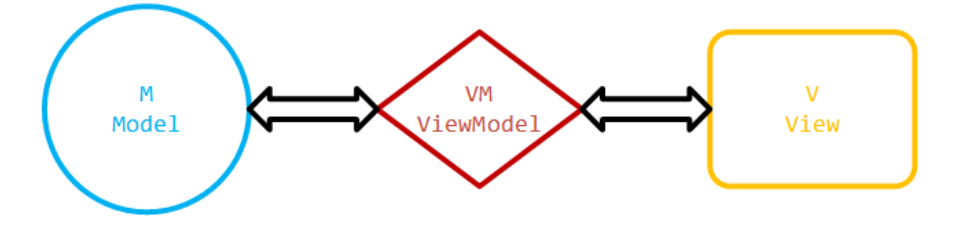
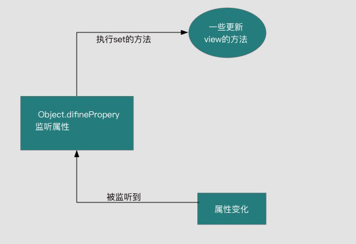
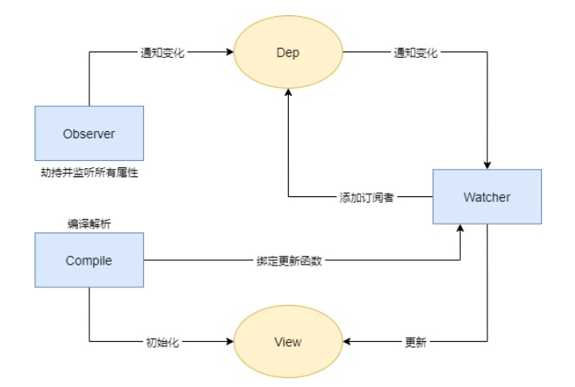
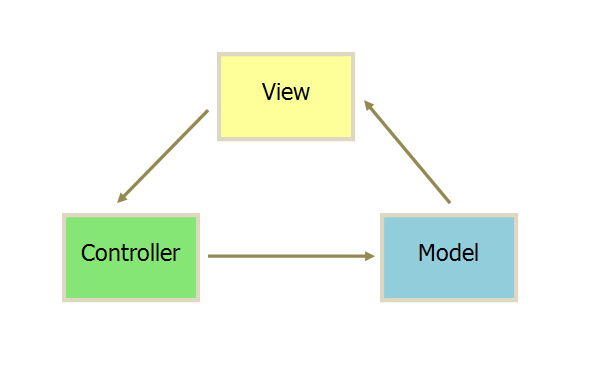

# vue的理解
- mvvm开发模式
- 组件化
    - 降低系统的耦合度
    - 调试方便
    - 便于维护
- 指令系统
# MVVM框架
### 一、定义

- M(model)：代表数据模型，数据和业务逻辑都在Model层中定义
- V(view):代表UI视图,即用户看到的界面，负责将数据模型中的数据的展示
- VM(view model):连接vm，每当V和M进行数据的调度时，都需要经过VM过中间的处理，使得 V层和 M层的同步工作完全是自动的。
### 二、双向绑定
#### 1.双向绑定(MVVM)原理
原理：数据变化更新视图，视图变化更新数据

Vue采用数据劫持+发布者-订阅者模式，通过Object.defineProperty()来劫持各个属性的setter、getter，在数据变动时发布消息给订阅者，触发相应的监听回调（Object.defineProperty可以控制一个对象属性的一些特有操作，比如读写权、是否可以枚举等，双向绑定时主要用到set和get属性）

发布者-订阅者模式：其定义对象间一种一对多的依赖关系，当一个 对象的状态发生改变时，所有依赖它的对象都将得到通知

#### 2.双向绑定(MVVM)原理

view更新data其实可以通过事件监听即可，比如input标签监听 'input' 事件就可以实现了。
所以我们着**重来分析下，当数据改变，如何更新视图的**。
通过Object.defineProperty( )对属性设置一个set函数，当数据改变了就会来触发这个函数，所以我们只要将一些需要更新的方法放在这里面就可以实现data更新view

**实现方法**
- 实现一个监听器Obsrver，用来劫持并监听所有属性，如果属性发生变化，就通知订阅者
- 实现一个订阅器Dep，用来收集订阅者，对监听器Observer和订阅者Watcher进行统一管理
- 实现一个订阅者Watcher，可以收到属性的变化通知并执行相应的方法，从而更新视图
- 实现一个解析器Compile，可以解析每个节点的相关指令，对模板数据和订阅器进行初始化

### 3.mvc 和mvvm的区别
**1.mvc** 
- m（model）模型层:数据保存
-v (view):视图层，用户看到的界面。
-c (controller)，控制器：业务逻辑

View 传送指令到 Controller
Controller 完成业务逻辑后，要求 Model 改变状态
Model 将新的数据发送到 View，用户得到反馈
所有的通信都是单向的。

mvc 的优点：
- 耦合性低，视图层和业务层分离。
- 可维护性高
缺点：
- 不适合小型项目的开发，适合大型项目的分层开发。

**2. mvvm**
MVVM是Model-View-ViewModel的简写，即模型-视图-视图模型。

Modal：模型，指的是后端传递的数据。
View：视图，指的是所看到的页面。
ViewModal：视图模型，mvvm模式的核心，它是连接view和model的桥梁。主要用来处理业务逻辑。

和mvc设计模式不同的是，mvvm采用了双向绑定：view的变动，可以自动反应在vm层。