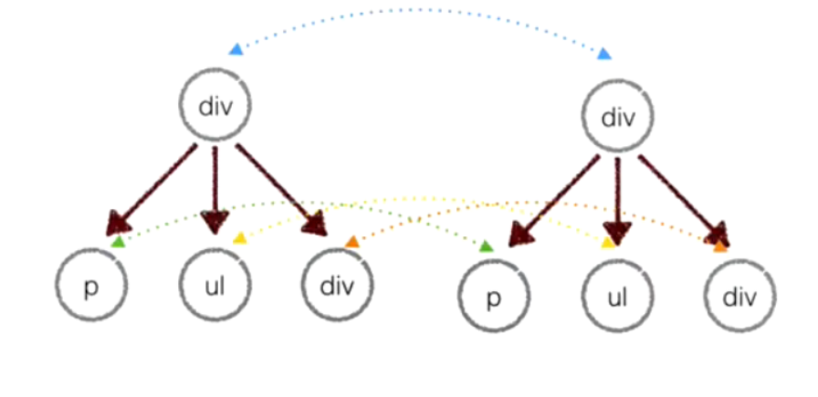
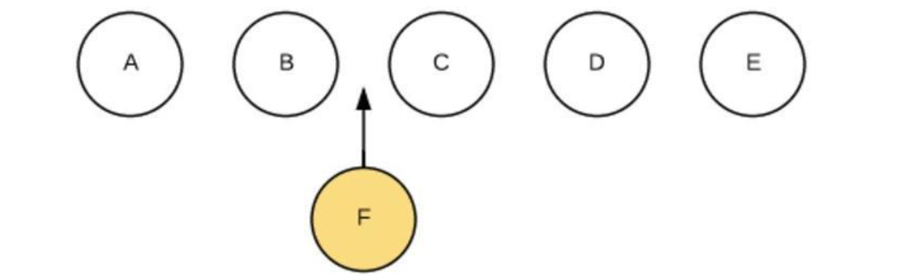
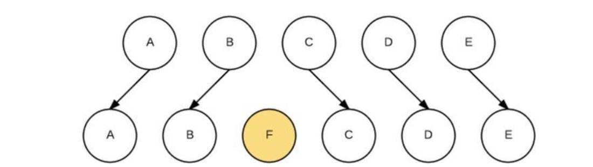

# 虚拟dom
一、原理：
用JavaScript对象模拟真实dom，对真实dom进行抽象
diff算法 比较两颗虚拟dom树的差异
patch算法 将两个虚拟dom对象的差异应用到真正的dom树
二、优缺点：
- **保证性能下限** 框架的虚拟dom需要适配任何上层api可能产生的操作，它的一些dom操作的实现必须是普适的，所以它的性能并不是最优的，但是比起粗暴的dom操作性能要好很多，因此框架的虚拟dom至少可以保证在你不需要手动优化的情况下，依然可以提供还不错的性能，即保证性能的下限
- **无需手动操作dom** 我们不再需要手动去操作dom，只需要写好view-model的代码逻辑，框架会根据虚拟dom和数据双向绑定，帮我们以可预期的方式更新视图，极大提高我们的开发效率
- **跨平台** 虚拟dom本质上是JavaScript对象，而dom与平台强相关，相比之下虚拟dom可以进行更方便地跨平台操作，例如服务器渲染、weex开发等 
- **缺点无法极致优化** 虚拟dom+合理的优化，足以应对绝大部分应用的性能需求，但在一些性能要求极高的应用中虚拟dom无法进行针对性的极致优化

**三、diff原理**

**（一）算法原理**
比较两棵Dom树的差异，虚拟Dom算法最核心的部分，这也就是Diff算法。

Diff的原理就是当前的真实的DOM生成一棵Virtual DOM也就是虚拟DOM，当虚拟DOM的某个节点的数据发生改变会生成一个新的Vnode, 然后这个Vnode和旧的oldVnode对比，发现有不同，直接修改在真实DOM上。

其中需要注意的是，要比较两棵树完全相同的时间复杂度是O(n^3)（具体原因见该论文），而React的Diff算法的时间复杂度是O(n)。要实现如此低的时间复杂度，意味着只能平层进行比较两棵树的节点，从而放弃深度遍历。纵然这样做会牺牲掉一定程度上的精确性来换取速度，但考虑到现实情况中，前端页面通常也不会跨层移动DOM元素。也就是，同一个层级的元素只会和同一个层级的进行比较，第一层的div只会和同一层级的div对比，第二层级的只会和第二层级的对比。这样算法复杂度就可以达到O(n)，因此这样做是最优的。


**(二)、diff比较算法**
下面我们创建一棵新树，用于和之前的树进行比较，来看看Diff算法是怎么操作的。
```
/*
* Old tree
*/
const tree = Element('div', {id: 'virtual-container'}, 
    Element('p', {}, ['Virtual DOM']),
    Element('div', {}, ['before update']),
    Element('ul', {}, [
      Element('li', {class: 'item'}, [' Item 1']),
      Element('li', {class: 'item'}, [' Item 2']),
      Element('li', {class: 'item'}, [' Item 3']),
    ]),
]);
 
const root = tree.render();
document.getElementById('virtualDom').appendChild(root);

/*
* New tree
*/
const tree = Element('div', {id: 'virtual-container'}, 
    Element('h3', {}, ['Virtual DOM']),                // REPLACE
    Element('div', {}, ['after update']),              // TEXT
    Element('ul', {class: 'marginLeft10'}, [           // PROPS
      Element('li', {class: 'item'}, ['Item 1']),
      // Element('li', {class: 'item'}, ['Item 2']),   // REORDER remove
      Element('li', {class: 'item'}, ['Item 3']),
    ]),
]);
```
1. 节点类型变化
例如上面的p标签变成了h3标签，这个过程称之为REPLACE，直接卸载旧节点、装载新节点，旧节点包括下面的子节点都将被卸载。

但当遇到新节点和旧节点仅仅是类型不同，但下面的所有的子节点都一样时，这样做的效率明显不高。尽管如此，与整个树的操作相比，这样还是值得的。
2. 节点类型一致，但属性或属性值改变

例如上面的ul标签增加了类属性'marginLeft10'。这个过程称之为PROPS。此时不会触发节点的卸载和装载，只是节点更新。

```
// 查找不同属性的方法
function diffProps(oldNode, newNode) {
  const oldProps = oldNode.props;
  const newProps = newNode.props;

  let key;
  const propsPatches = {};
  let isSame = true;

  // find out different props
  for (key in oldProps) {
    if (newProps[key] !== oldProps[key]) {
      isSame = false;
      propsPatches[key] = newProps[key];
    }
  }

  // find out new props
  for (key in newProps) {
    if (!oldProps.hasOwnProperty(key)) {
      isSame = false;
      propsPatches[key] = newProps[key];
    }
  }
  return isSame ? null : propsPatches;
}
```
3. 文本内容改变

文本对也是一个Text Node，直接修改文字内容即可。这个过程称之为TEXT。

4. 移动 / 增加 / 删除 子节点

这个过程称之为REODER。如下图，在A、
B、C、D、E五个节点的B和C中的BC两个节点中间加入一个F节点



简单粗暴的做法是遍历每一个新虚拟DOM的节点，与旧虚拟DOM对比相应节点对比，在旧DOM中是否存在，不同就卸载原来的按上新的。这样会对F后边每一个节点进行操作。卸载C，装载F，卸载D，装载C，卸载E，装载D，装载E。效率太低。



如果我们在React里的JSX里，为数组或枚举型元素增加上key后，它能够根据key。当要对某个节点进行操作时，就可以直接找到具体位置进行操作，效率比较高。常见的最小编辑距离问题，可以用Levenshtein Distance算法来实现，时间复杂度是O(M*N)，但通常前端只要一些简单的移动就能满足需要，降低精确性，将时间复杂度降低到O(max(M,N))即可。最终Diff出来的结果如下：

```
{
    1: [{type: REPLACE, node: Element}],
    2: [{type: TEXT, content: "after update"}],
    3: [{type: PROPS, props: {class: "marginLeft10"}}],
    4: [{type: REORDER, moves: {index: 2, type: 0}}],
}
```

**（三）通过patches，映射成真实DOM**

根据上述操作，此时我们已经有了虚拟的DOM，也有了Diff的结果，因此就可以将结果应用到真实的DOM上了。深度遍历DOM将Diff的内容更新进去

```
function dfsWalk(node, walker, patches) {
  const currentPatches = patches[walker.index];
  
  const len = node.childNodes ? node.childNodes.length : 0;
  for (leti = 0; i < len; i++) {
    walker.index++;
    dfsWalk(node.childNodes[il, walker, patches);
  }
  
  if (currentPatches) {
    applyPatches(node, currentPatches);
  }
}

function applyPatches(node, currentPatches) {
  currentPatches.forEach((currentPatch) => {
    switch (currentPatch.type) {
      case REPLACE: {
        const neNode = (typeof currentPatch.node === 'string')
            ? document.createTextNode(currentPatch.node)
            : currentPatch.node.render();
        node.parentNode.replaceChild(neNode, node);
        break;
      }
      case REORDER:
        reorderChildren(node, currentPatch.moves);
        break;
      case PROPS:
        setProps(node, currentPatch.props);
        break;
      case TEXT:
        if (node.textContent) {
          node.textContent = currentPatch.content;
        } else {
          //ie
          node.nodeValue = currentPatch.content;
        }
        break;
      default:
        throw new Error(`Unknown patch type ${currentPatch.type}`);
    }
  });
}
```

**总结**
简而言之，会使用两个虚拟的DOM（JS对象，new/old进行比较diff)，用户交互后，操作数据变化new虚拟DOM，而old虚拟DOM则会映射成真实DOM（js对象生成的DOM文档），通过js的DOM fragment 操作给浏览器渲染。当修改new虚拟DOM时，会把newDOM和oldDOM通过Diff算法比较，得出Diff结果数据表（用4种变换情况表示），最后再把Diff的结果表通过JS的DOM fragment更新到浏览器DOM中。